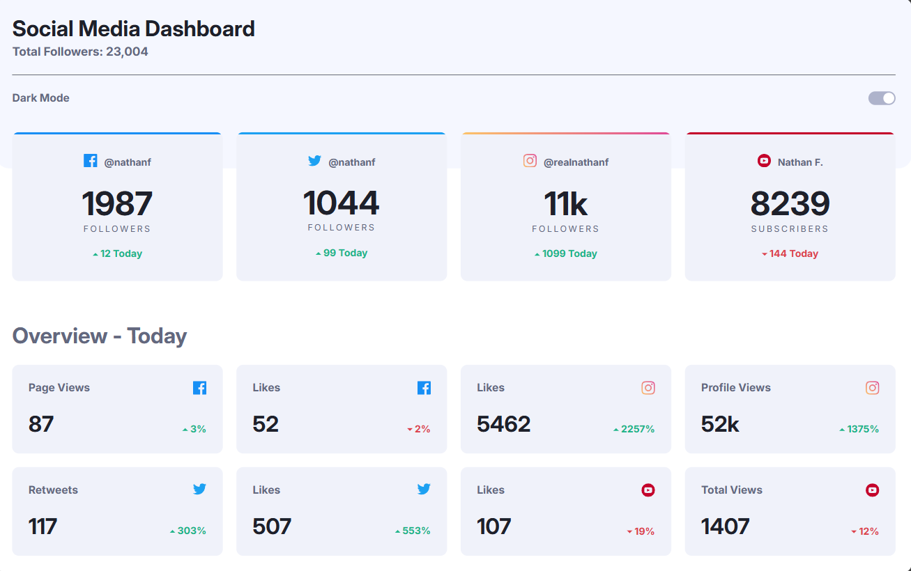

# Frontend Mentor - Social media dashboard with theme switcher solution

This is my solution to the [Social media dashboard with theme switcher challenge on Frontend Mentor](https://www.frontendmentor.io/challenges/social-media-dashboard-with-theme-switcher-6oY8ozp_H).

## Table of contents

- [Overview](#overview)
  - [The challenge](#the-challenge)
  - [Screenshot](#screenshot)
  - [Links](#links)
- [My process](#my-process)
  - [Built with](#built-with)
  - [What I learned](#what-i-learned)
  - [Continued development](#continued-development)
  - [Useful resources](#useful-resources)
  - [AI Collaboration](#ai-collaboration)
- [Author](#author)

## Overview

### The challenge

Users are be able to:

- View the optimal layout for the site depending on their device's screen size
- See hover states for all interactive elements on the page
- Toggle color theme to their preference

### Screenshot



### Links

- Solution URL: [GitHub](https://github.com/WesSno/Social-Media-Dashboard-with-Theme-Switcher)
- Live Site URL: [Netlify](https://your-live-site-url.com)

## My process

### Built with

- Semantic HTML5 markup
- CSS custom properties
- Flexbox
- CSS Grid
- Mobile-first workflow
- [React](https://reactjs.org/) - JS library

### What I learned

- Implemented light and dark theme switching using CSS custom properties (CSS variables), making the UI easier to maintain and scale.
- Built reusable React components to render both the social media summary cards and overview cards from a single component.
- Structured application data in JSON files and dynamically rendered UI elements by mapping over the data.

- Managed application-wide theme state with React and used the `useEffect` hook to synchronize the selected theme with the `body` element.

```js
useEffect(() => {
  document.body.className = isDarkMode ? "dark-theme" : "light-theme";
}, [isDarkMode]);
```

- Improved my understanding of React props, state management, and component composition by building a data-driven UI.

### Continued development

In future iterations of this project, I would like to:

- Replace the static JSON data with a real-time API to simulate a production-ready dashboard.
- Persist the user's theme preference using _localStorage_ so the selected theme remains after refreshing the page.
- Enhance accessibility by improving keyboard navigation and adding appropriate ARIA attributes where necessary.

### Useful resources

- [Frontend Mentor](https://www.frontendmentor.io/challenges/social-media-dashboard-with-theme-switcher-6oY8ozp_H) - This provided me with some of the resources needed to complete this challenge.

### AI Collaboration

AI was used as a learning and development aid throughout this project. Specifically, I used ChatGPT to:

- Debug React, JavaScript, and CSS issues during development.
- Brainstorm implementation strategies and compare different approaches before making design decisions.
- Deepen my understanding of React concepts such as state management, reusable components, props, and CSS custom properties.
- Refine the project structure and improve the clarity and professionalism of the project documentation, including this README.

## Author

- Website - [Kofi Baafi Kwatia](https://github.com/WesSno)
- Frontend Mentor - [@WesSno](https://www.frontendmentor.io/profile/WesSno)
